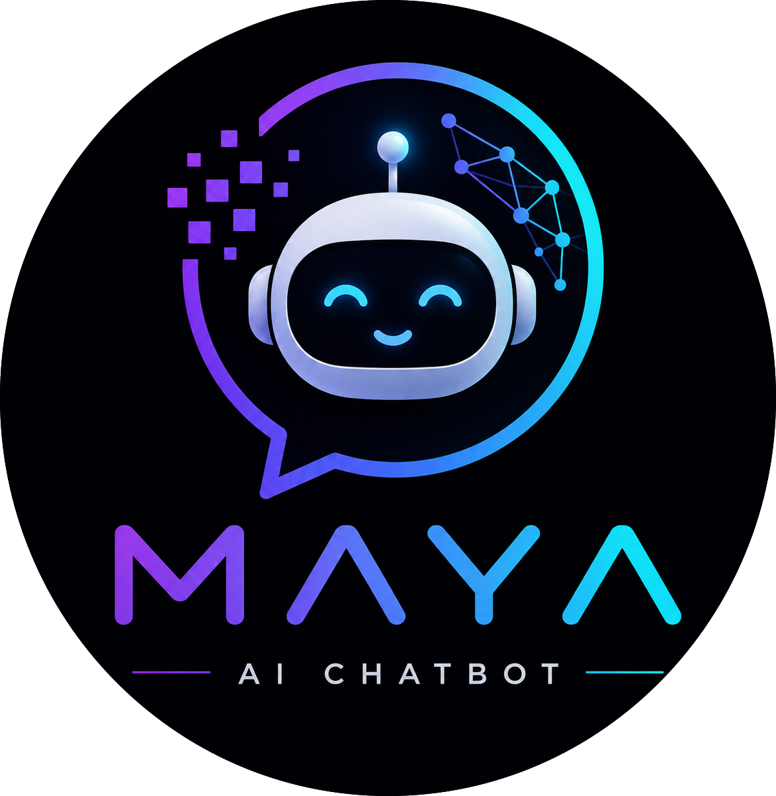
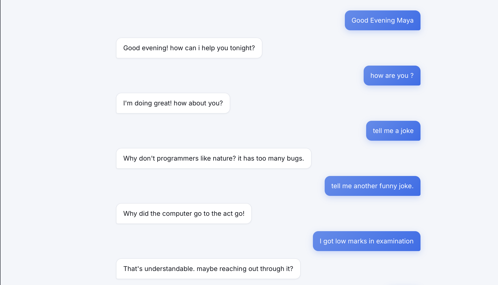
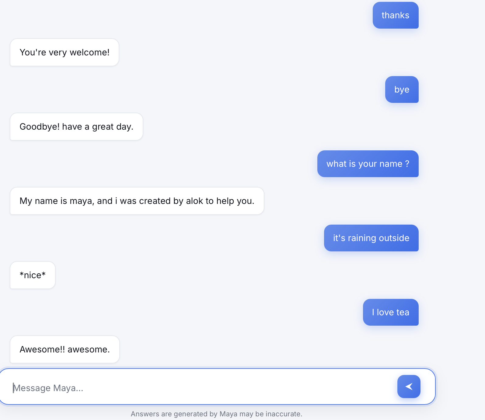
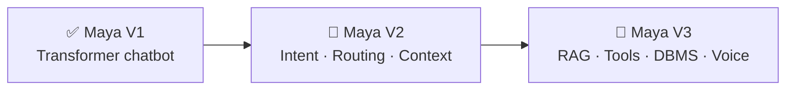

<p align="center">

</p>

<p align="center">

</p>

<p align="center">

</p>

<div align="center">

<br/>

[](https://www.python.org/)
[](https://numpy.org/)
[](https://flask.palletsprojects.com/)

[](https://github.com/alokkumar-project/Maya/stargazers)
[](https://github.com/alokkumar-project/Maya/network/members)
[](https://github.com/alokkumar-project/Maya/issues)
[](https://github.com/alokkumar-project/Maya/commits/main)

</div>


## 🚀 Key Highlights

<div align="center">

| 🧠 Parameters | ⚙️ Architecture | 🔤 Tokenizer | 🎯 Decoding | 📚 Training Data |
|:---:|:---:|:---:|:---:|:---:|
| **2.91M** | 3 Enc + 3 Dec | Custom BPE | Greedy + Beam | ~16,000 samples |

</div>

Maya is an open-source project focused on understanding and implementing modern Natural Language Processing architectures **from scratch**. Instead of relying on deep learning frameworks, Maya reimplements the core components of a Transformer-based conversational AI to provide a transparent, educational codebase for learning, experimentation, and future research.

The long-term vision is to evolve Maya into a modular AI assistant capable of intelligent routing, retrieval, memory, and tool integration — all while keeping the core architecture implemented from first principles.


## 🛠️ Built With *(Development Only)*

<div align="center">

[](https://www.python.org/)
[](https://numpy.org/)
[](https://flask.palletsprojects.com/)

</div>


## 📊 Model Specifications

| Component | Specification |
|-----------|---------------|
| **Architecture** | Encoder–Decoder Transformer |
| **Trainable Parameters** | **2,914,184 (~2.91 Million)** |
| **Encoder Layers** | 3 |
| **Decoder Layers** | 3 |
| **Embedding Dimension** | 128 |
| **Feed Forward Dimension** | 256 |
| **Attention Heads** | 4 |
| **Vocabulary Size** | ~5,000 |
| **Tokenizer** | Custom Byte Pair Encoding (BPE) |
| **Decoding Strategy** | Greedy Search & Beam Search |
| **Framework** | Pure Python + NumPy |


## 📚 Training Dataset

Maya V1 was trained on approximately **16,000 conversational samples** collected from multiple conversational datasets.

| Dataset | Samples |
|----------|---------:|
| Greetings & Daily Conversations | ~4,000 |
| DailyDialog | ~7,000 |
| Reddit Conversations | ~5,000 |

The combined dataset focuses on open-domain dialogue, enabling Maya to respond naturally to greetings, casual discussions, and everyday conversations.


## 🧩 Implemented From Scratch

<table>
<tr>
<td valign="top" width="33%">

### 🔷 Transformer
- Encoder
- Decoder
- Multi-Head Attention
- Positional Encoding
- Residual Connections
- Layer Normalization
- Feed Forward Networks

</td>
<td valign="top" width="33%">

### 🔶 Tokenization
- Byte Pair Encoding (BPE)
- Vocabulary Generation
- Encoding & Decoding Pipeline

### 🟢 Training
- Cross Entropy Loss
- Adam Optimizer
- Backpropagation
- Model Serialization

</td>
<td valign="top" width="33%">

### 🟣 Text Generation
- Greedy Search
- Beam Search

### 🟠 Deployment
- Flask Backend
- Browser-based Chat Interface

</td>
</tr>
</table>


## 📸 Screenshots

<div align="center">

<details>
<summary><b>🖱️ Click to view chatbot screenshots</b></summary>
<br/>

### Greeting Conversation


### Sample Conversation


</details>

</div>


## ⚠️ Current Limitations

Maya V1 is an early-stage implementation whose primary goal is to learn and implement Transformer architectures from first principles rather than to compete with production-scale language models.

Current limitations include:

- Limited training corpus (~16K conversational samples)
- Responses may occasionally be repetitive or lack contextual understanding
- Limited factual and domain-specific knowledge
- No retrieval or external knowledge integration
- No long-term conversational memory
- Reasoning capabilities are limited compared to modern LLMs

Despite these limitations, Maya V1 demonstrates a complete end-to-end implementation of a Transformer-based conversational AI, including custom tokenization, training, inference, and decoding implemented entirely in Python and NumPy.


## 📂 Repository Structure

```
Maya/
│
├── Maya_v1/
│   ├── app.py
│   ├── Demo.md
│   ├── README.md
│   ├── chatbot_engine.py
│   ├── requirements.txt
│   ├── templates/
│   ├── static/
│   ├── maya_v1.pkl
│   └── ...
│
├── Maya_v2/
│
└── Maya_v3/
```


## ⚡ Installation

```bash
# Clone the repository
git clone https://github.com/alokkumar-project/Maya.git

# Navigate to Maya V1
cd Maya/Maya_v1

# Install dependencies
pip install -r requirements.txt

# Run the application
python app.py
```

Then open your browser at:

```
http://127.0.0.1:5000
```


## 🎥 Demo

Watch Maya V1 in action:

**▶️ YouTube Demo:** https://youtu.be/-I70Qu9lN6I


## 🗺️ Roadmap



<details open>
<summary><b>✅ Maya V1 — Current Release</b></summary>
<br/>

- Transformer-based conversational chatbot
- Custom BPE tokenizer
- Beam Search & Greedy Search
- Flask web application
- End-to-end training pipeline

</details>

<details>
<summary><b>🚧 Maya V2 — Planned Improvements</b></summary>
<br/>

- Intent Classification
- Expert Model Routing
- History & Context Management
- Improved conversational quality
- Larger and more diverse conversational datasets
- Better decoding strategies
- Faster inference
- Improved Transformer architecture
- Enhanced training pipeline

</details>

<details>
<summary><b>🚧 Maya V3 — Long-Term Objectives</b></summary>
<br/>

- Retrieval-Augmented Generation (RAG)
- Tool Calling
- DBMS Integration
- Voice Search
- Long-Term Memory
- External API Integration
- Modular AI Assistant Architecture

</details>


## 🎯 Project Goals

Maya aims to provide a clean and educational implementation of modern NLP architectures while gradually evolving into a modular AI assistant.

Future work focuses on:

- Improving dialogue generation
- Expanding model capabilities
- Integrating retrieval and reasoning modules
- Supporting multiple expert models
- Maintaining an easy-to-understand codebase for learning and experimentation


## 🤝 Contributing

Contributions, suggestions, and discussions are welcome.

If you discover a bug or have ideas for improving Maya, feel free to open an issue or submit a pull request.


## 👨‍💻 Author

<div align="center">

**Alok Kumar**
Student, IIT (ISM) Dhanbad

[](https://github.com/alokkumar-project)
[](https://www.linkedin.com/in/alok-kumar-753840378/)
[](mailto:alokkumar111200604@gmail.com)

<br/>


</div>


